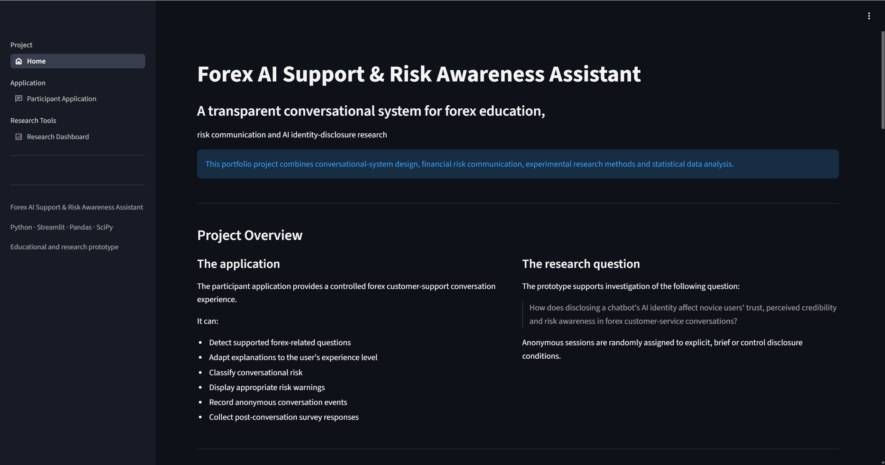
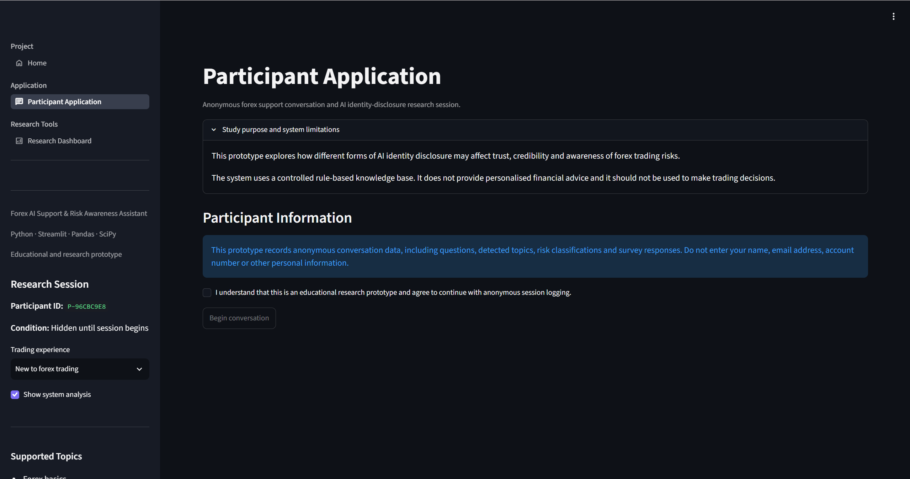
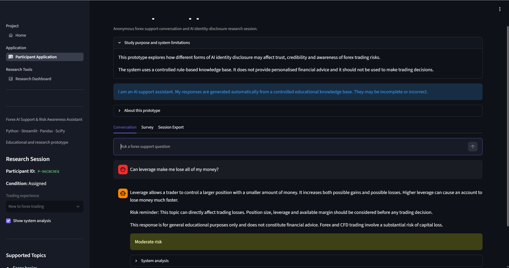
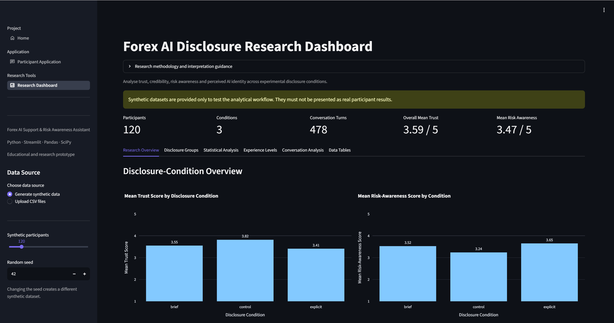
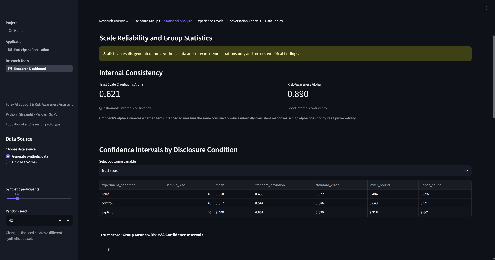
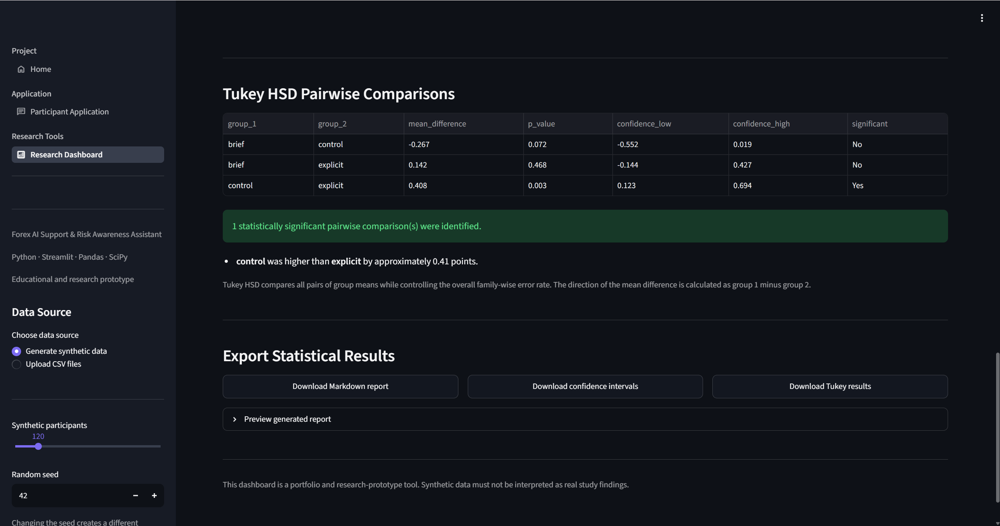

# Forex AI Support & Risk Awareness Assistant

A transparent conversational and research prototype for forex education, financial-risk communication and AI identity-disclosure analysis.

The project combines a controlled customer-support chatbot, anonymous experimental sessions, trust and risk-awareness surveys, statistical analysis and automated research reporting.

[](https://forex-ai-support-risk-awareness.streamlit.app)



## Live Application

The deployed application will be available at:

`https://forex-ai-support-risk-awareness.streamlit.app`

## Project Purpose

The project supports exploration of the following research question:

> How does disclosing a chatbot's AI identity affect novice users' trust, perceived credibility and risk awareness in forex customer-service conversations?

The system provides three AI identity-disclosure conditions:

- Explicit AI disclosure
- Brief AI disclosure
- Control condition without a prominent disclosure banner

The control condition does not claim that the assistant is human. General system information remains available within the application.

## Application Structure

The project is presented as a three-page Streamlit application:

- **Home** — project purpose, experimental design and technical architecture
- **Participant Application** — anonymous conversation and survey experience
- **Research Dashboard** — data validation, statistical analysis and reporting

## Participant Application

The participant interface provides:

- Anonymous participant identifiers
- Consent and privacy information
- Random disclosure-condition assignment
- Trading-experience selection
- Forex customer-support conversation
- Rule-based intent detection
- Conversational risk classification
- Experience-adjusted explanations
- High-risk warning messages
- Conversation logging
- Post-conversation survey
- Anonymous CSV export





## Supported Forex Topics

- Forex trading basics
- Lot sizes
- Leverage
- Margin
- Spreads
- Stop-loss orders
- Loss exposure
- Guaranteed-profit claims

## Risk Classification

The system classifies conversational risk into three levels:

- **Low risk** — general educational questions
- **Medium risk** — leverage, margin, losses or risk-control topics
- **High risk** — guaranteed returns, excessive leverage and potentially harmful trading behaviour

Responses are generated from a controlled knowledge base and include risk notices appropriate to the detected topic.

## Experimental Design

Each anonymous session is randomly assigned to one disclosure condition:

### Explicit disclosure

Clearly states that the user is interacting with an AI support assistant and communicates system limitations.

### Brief disclosure

Provides a concise statement that the user is speaking with an AI assistant.

### Control condition

Does not show a prominent disclosure banner, while retaining system information elsewhere in the application.

After at least two conversation turns, participants can complete a post-conversation survey measuring:

- Perceived reliability
- Confidence in the assistant
- Perceived credibility
- Risk awareness
- Understanding of leverage and losses
- AI identity-disclosure clarity
- Overall helpfulness
- Perceived system identity

## Research Dashboard

The research dashboard supports:

- Synthetic experimental-data generation
- Survey and conversation CSV upload
- Required-column validation
- Disclosure-condition comparisons
- Trading-experience comparisons
- Detected-intent analysis
- Conversational-risk distributions
- Response-time analysis
- Data-table inspection and export



## Statistical Analysis

The dashboard includes:

- Composite trust scoring
- Composite risk-awareness scoring
- Cronbach's alpha
- Group means
- 95% confidence intervals
- One-way ANOVA
- Eta-squared effect size
- Tukey HSD post-hoc comparisons
- Automated interpretation
- Downloadable statistical tables
- Downloadable Markdown research reports





## Automated Statistical Reports

The application can generate a Markdown report containing:

- Sample and condition counts
- Trust-scale reliability
- Risk-awareness-scale reliability
- Group means and confidence intervals
- ANOVA results
- Eta-squared effect size
- Tukey HSD pairwise comparisons
- Interpretation limitations
- Synthetic-data warnings where applicable

## Synthetic Demonstration Data

The project includes a configurable synthetic-data generator to test the analytical workflow before real participant data is available.

Artificial condition differences are included only so that:

- Charts can be tested
- Statistical functions can be validated
- Reports can be generated
- Upload and export workflows can be demonstrated

Synthetic results are not empirical research findings and must not be presented as real evidence.

## Privacy and Ethics

The prototype does not request:

- Names
- Email addresses
- Account numbers
- Financial-account credentials
- Other directly identifying information

Conversation records and survey responses remain in the active Streamlit browser session unless explicitly downloaded.

The current portfolio version is not a production research-data platform.

Formal deployment with real participants would require:

- Ethics approval
- Participant information and consent documents
- Secure database storage
- Authentication and access controls
- Data-retention and deletion procedures
- Participant withdrawal procedures
- Formal privacy review

## Transparent System Design

The conversational system currently uses:

- Predefined intent keywords
- Explicit risk-classification rules
- A controlled forex knowledge base
- Deterministic response generation

It does not currently use a generative language model.

This design was selected to make responses:

- Explainable
- Reproducible
- Testable
- Suitable for controlled experimentation
- Less likely to produce unsupported financial claims

## Technology Stack

- **Python** — application and analytical logic
- **Streamlit** — multipage user interface
- **Pandas** — data preparation and analysis
- **NumPy** — numerical calculations and synthetic data
- **Plotly** — interactive visualisation
- **SciPy** — statistical testing
- **pytest** — automated unit testing
- **Git and GitHub** — version control and source hosting

## Project Architecture

```text
forex-ai-support-assistant
│
├── streamlit_app.py
├── home.py
├── participant_app.py
├── research_dashboard.py
├── research_analytics.py
├── research_statistics.py
├── research_report.py
├── sample_data_generator.py
├── config.py
├── experiment.py
├── conversation_logger.py
├── survey.py
├── knowledge_base.py
├── intent_detector.py
├── risk_engine.py
├── response_generator.py
├── assets
│   ├── home-page.png
│   ├── participant-consent.png
│   ├── participant-chat.png
│   ├── research-overview.png
│   ├── statistical-analysis.png
│   └── tukey-report.png
├── .streamlit
│   └── config.toml
├── tests
├── requirements.txt
├── LICENSE
└── README.md
```

## Module Responsibilities

- `streamlit_app.py` manages global configuration and navigation.
- `home.py` presents the project overview and architecture.
- `participant_app.py` manages consent, conversation and survey workflows.
- `intent_detector.py` identifies supported user topics.
- `risk_engine.py` assigns conversational risk levels.
- `knowledge_base.py` stores controlled educational responses.
- `response_generator.py` creates experience-adjusted responses.
- `experiment.py` manages anonymous experimental sessions.
- `conversation_logger.py` structures conversation records.
- `survey.py` collects post-conversation responses.
- `sample_data_generator.py` produces synthetic demonstration datasets.
- `research_analytics.py` creates descriptive and composite metrics.
- `research_statistics.py` performs reliability and inferential analysis.
- `research_report.py` generates downloadable statistical reports.
- `research_dashboard.py` presents the research-analysis interface.

## Installation

Clone the repository:

```bash
git clone https://github.com/BadSterling/forex-ai-support-risk-awareness.git
cd forex-ai-support-risk-awareness
```

Create a virtual environment:

```bash
python -m venv .venv
```

Activate it on Windows PowerShell:

```powershell
.venv\Scripts\Activate.ps1
```

Install dependencies:

```bash
python -m pip install -r requirements.txt
```

## Run Locally

```bash
python -m streamlit run streamlit_app.py
```

The application should open at:

```text
http://localhost:8501
```

## Run Tests

```bash
python -m pytest
```

## Limitations

- The conversational prototype supports a limited set of forex topics.
- Intent detection currently uses keyword rules.
- The system does not understand unrestricted natural-language questions.
- Session data is not persisted in a production database.
- Synthetic statistics are not empirical findings.
- Statistical outputs require appropriate assumptions and study design.
- The project does not provide financial advice.
- The project is not a trading platform and does not execute orders.

## Future Improvements

- Secure research database
- Authentication and administrator access controls
- Ethics-approved real-participant workflow
- More comprehensive knowledge base
- Multilingual conversation support
- Retrieval-augmented response generation
- Optional large-language-model integration
- Prompt and response safety evaluation
- Research data anonymisation pipeline
- Post-hoc assumption diagnostics
- GitHub Actions continuous integration

## Disclaimer

This project is intended for educational, research and portfolio demonstration purposes only.

It does not provide financial advice, investment recommendations or personalised trading guidance. Forex and CFD trading involve a substantial risk of capital loss.

Synthetic data and generated statistical outputs must not be presented as real participant findings.

## Author

**Xiangyu Yuan**

UQ Master of Information Technology student with experience in financial-market content, data analysis, software development and human-centred AI research.